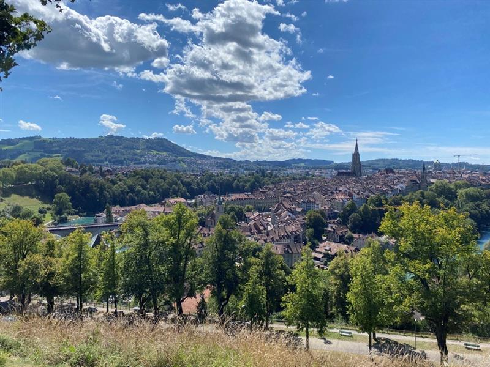
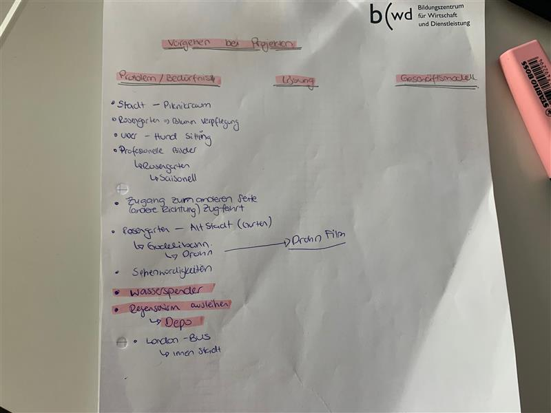

+++
title = "Projektideensammlung"
date = "2020-08-26"
draft = false
pinned = false
+++

**Beginn unserer kleinen Reise auf die Suche nach einem Projekt**

Heute, der 26.08.2020, bekamen wir einen neuen Auftrag im Fach Web. Der Auftrag war Sammlung der Ideen für einen neuen Projekt, dafür hatten wir zwei Stunden zeit, um uns zu überlegen was wir so machen könnten. Nach langer Überlegung, wie wir uns inspirieren können, entschieden wir (ich

 und Delighty) uns in Rosengarten hinzugehen und uns dort mit der Aussicht vom Stadt inspirieren lassen. Uns kamen viele verschiedene Ideen durch den Kopf, viele waren gar nicht so realistisch, welche wir umsetzten können, trotzt alle, haben wir alles auf einem Blatt aufgeschrieben. es gab vielen , von Fantasie bis zur Realität. 

Idee:

Als wir einige Minuten die Aussicht geniessten, stellten wir uns vor wie es wäre, wenn eine kleine Gondelbahn von Rosengarten bis zu Gurten mit einem Zwischenstopp fahren würde. Man könnte von oben die Altstadt sehen, hat eine direkte Verbindung zur Gurtenbahn und somit eine neue “Sehenswürdigkeit”, was uns in Bern etwas fehlt.

