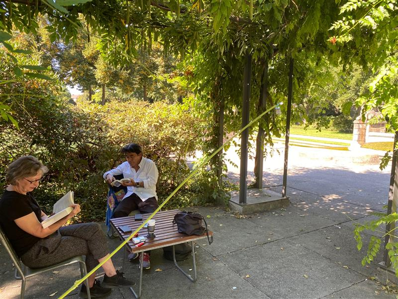

+++
title = "Weiterarbeit an unser Projekt "
date = "2020-09-02"
draft = false
pinned = false
image = "work-in-progress.jpg"
description = "Wir haben uns heute mit unserem eigenen Projekt beschäftig und Ziele gesetzt, wie wir nächste Woche weiterfahren können.  Unser Ziel ist möglichst viele Bilder beim guten Wetter zu machen, damit unser Filmvideo mehr farbig und lebendig aussieht. Beim schlechten Wetter kann man nicht vieles fotografieren und es sieht auch nicht sehr schön aus. Ob wir eine Drohe finden, wissen wir noch nicht, aber wir wollen zuerst mit unserer Idee weitermachen. Wenn unsere Idee funktioniert werden wir auch mehr wert an Technologie legen, damit ein professionelles Filmvideo herauskommt."
+++

**Ziel**

Wir haben uns heute mit unserem eigenen Projekt beschäftig und Ziele gesetzt, wie wir nächste Woche weiterfahren können.  Unser Ziel ist möglichst viele Bilder beim guten Wetter zu machen, damit unser Filmvideo mehr farbig und lebendig aussieht. Beim schlechten Wetter kann man nicht vieles fotografieren und es sieht auch nicht sehr schön aus.

**Problem**

Ob wir eine Drohe finden, wissen wir noch nicht, aber wir wollen zuerst mit unserer Idee weitermachen. Wenn unsere Idee funktioniert werden wir auch mehr wert an Technologie legen, damit ein professionelles Filmvideo herauskommt.

**Neue Idee**